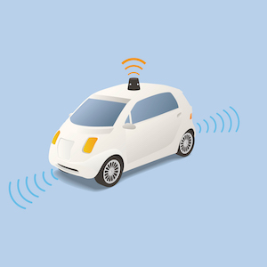

## Ethics For Software Engineers

The rules that software engineers should live by are virtuous. As the software we code becomes integrated into mission critical systems, there needs to be an emphasis on its quality. Something as minute as a float datatype being casted to an integer datatype can mean the difference between an airplane’s software crashing the plane or having it land smoothly. Though I agreed with most of it, I disagreed with the importance of the ethics. Some of the codes of conduct gave off the tone of altruism rather than the tone of the non-aggression principle. After being exposed to objectivism and the philosophy presented by the late Ayn Rand, I feel that these ethics should be in the self-interest of software engineers rather than the in the interest of others. For example, it is within the self interest of software engineers and software companies that their software doesn’t accidentally kill people. If people know that a certain piece of software is defective and buggy, they simply won’t use it. Thus, there is a financial incentive for the company to produce excellent software that won’t harm lives from negligence.

# Self Driving Smart Cars

I thoroughly enjoyed the case study on self driving cars. As much as we like to envision the positive impacts of self driving cars being able to reduce over 90% of accidents, there is still that 10%. But, the essential philosophical point of the study was whether or not your car should be a utilitarian. This is very important, as a utilitarian car would calculate that sacrificing you, the driver, would be more positive than having an unavoidable accident with a group of pedestrians.

# The Unavoidable Accident

Instead of arguing in circles of who should die in the hypothetical event of an unavoidable accident, we should look deeply into the fallacy of the unavoidable car accident. In the case of automobiles, accidents result from a variety of causes. Most accidents commonly occur from distracted and reckless driving and environmental hazards like snow or rain. Some accidents occur from design defects like tires blowing out or your brakes failing. There’s no such thing as an unavoidable accident if you drive at a safe speed relative to your environment and regularly maintain your vehicle. The example in the case study of your car crashing into a wall to save the lives of others at the cost of yours is an extreme case. If your car was going at a relatively safe speed and you (or the car) are able to react to the environment quickly, accidents don’t happen. The people that are developing these cars should keep these situations in mind and work to avoid them from happening. 

# A Paradigm Shift

Another thing that should be noted with the advent of smart cars is that the entire infrastructure of our roadways will change. When smart cars become the majority of vehicles on the road, we can change how we design roads, traffic, and crosswalks that will align with smart cars. When these other factors change in accordance to smart cars, we can prevent accidents with pedestrians of from the result of traffic. The unavoidable accidents of the past will be avoidable because of this new technology. If we really want to prevent accidents from happening on the road, we have to not only rethink our cars, we have to rethink the entire paradigm. 
