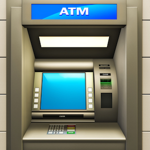
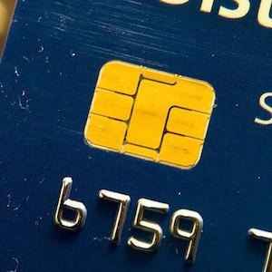
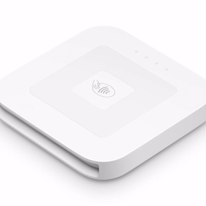
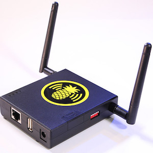

  
  
  
  

Attacking the Square Reader delved into the world of banking and the amount effort put into making transactions secure. It was intersting to understand the history behind the magnetic slip cards and why they needed to transistion to the chip and pin cards. It wasn't enough that we understood the weaknesses of the card reader, we also had to look into the weaknesses of the EMG card design itself. We attempted to exploit it from the hardware and software side.

We weren't able to find a weakness on the hardware level as we didn't understand the pieces that made the reader. The supplemental pineapple wi-fi device allowed us to experiment in whether or not there were vulnerabilities on the network level. Unfortunately, we weren't able to come up with any conclusive evidence with our research. But my teammate and I learned a lot about the technical aspects of ATMs, credit cards, and card readers, sparking our interest in security. 

You can read my research paper on my [github](https://github.com/markrcummins/square_reader_research/blob/master/695SquareReaderFinal%20(2).pdf).

